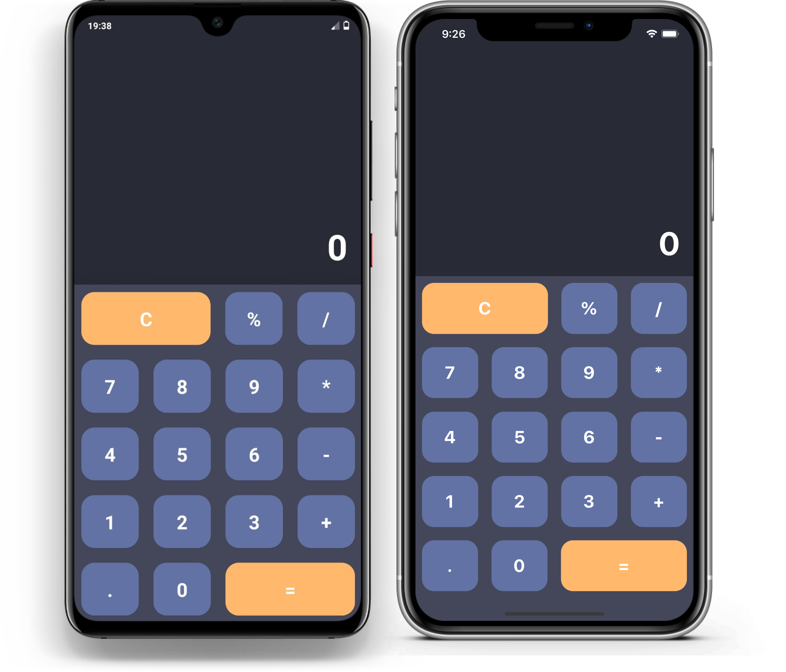

<h1 align="center">
    
    Dracula Calculator
</h1>

<h4 align="center">
  Dracula Calculator is a calculator app for Android and iOS developed in React Native with Expo based on the Dracula Theme
</h4>

  

## :exclamation: Important

**Work in progress: some features may not work properly!**

## :book: Developed with

- [React Native](https://facebook.github.io/react-native/)
- [Expo](https://expo.io/)
- [Dracula Theme](https://draculatheme.com/)

## :memo: License

This project is under the MIT license. See the [LICENSE file](LICENSE) for more details.
